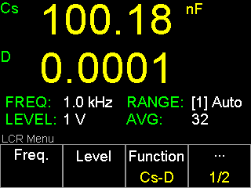
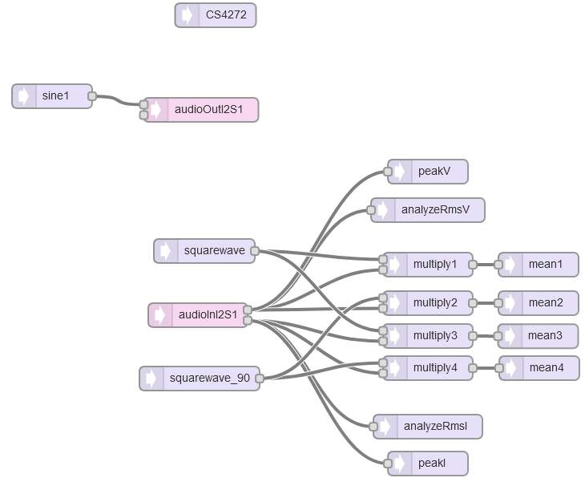

# TeensyLCR

- A Teensy 4.1 based LCR meter
- measure capacitance, inductance, resistance and other complex parameters
- 4 wire measurement
- using an audio codec to measure voltage and current
- ILI9341 320x240 Touchscreen with user interface

## LCR Meter Features

### Main Specifications

#### Test Signal

- Selectable test frequencies: 10 Hz to 90 kHz in 10 Hz steps.
- Selectable test levels: 300 mV, 600 mV, 1 V
- Output impedance: 100R, 1k, 10k, 100k, depends on LCR range.

#### Measurement Parameters

The following complex parameter of the DUT can be measured (fixed combinations of them):

Parameter | Description
--- | ---
Rs  | Equivalent series resistance (ESR)
Rp  | Parallel resistance
Cs  | Series capacitance
Cp  | Parallel capacitance
Ls  | Series inductance
Lp  | Parallel inductance
Phi | Phase angle of impedance
Xs  | Series reactance
Z   | Impedance
Q   | Quality factor
D   | Dissipation factor
G   | Conductance
B   | Susceptance

#### Test Range

- There are four ranges: 100R, 1k, 10k, 100k. The range will be selected automatically according to the impedance of the DUT.

#### Measurement Speed

- Minimum 100 ms per reading
- Minimum average of the readings can be set from 1 to 255 to improve performance.
- The effective averaging depends on selected test frequency and may be higher than selected.
- Display update rate is fixed at 200 ms and may be higher at low frequencies and high averaging value.

#### Accuracy

- Basic accuracy of at least 1%

#### Digits Resolution

- The measurement results of the meter can display 5 floating-point digits.

#### Display Range

Parameter   | Display Range
--- | ---
C           | 0.001 pF ~ TBD
L           | 0.01 µH ~ TBD
R, X, \|Z\| | 0.01 mΩ ~ 99.999 MΩ
G, B, \|Y\| | 0.01 µS ~ TBD
D           | 0.0001 ~ TBD
Q           | 0.0001 ~ TBD
Phi         | -180.000° ~ 180.000°

### Main Functions

#### Correction

The user can perform OPEN and SHORT correction used to eliminate stray admittance, residual impedances and other measurement errors. The OPEN and SHORT function performs open or short correction over 38 pre-set frequencies. The correction for all other frequencies are interpolated from those pre-set frequencies. The correction data is stored permanently on the EEPROM.

#### List Sweep

The sweep function scans the frequency over the component under test with up to 100 points.
It can sweep the frequency linearly or logarithmically. Results are presented in a table.
If a USB flash drive is connected, the table sweep results are saved as a text file.

## Additional Features

### USB Host

USB jack type-A, for connection to USB memory devices only. USB disk type: Flash disk only.
Format: FAT / FAT32 / exFAT.

Save screenshots (BMP format) to USB thump drive:

### Frequency Generator

- A simple frequency generator for debug purpose
- Signal output at HCUR connector
- Waveforms: sinus only
- Frequency: 1Hz - 90kHz
- Amplitude: 1mVp - 2.4Vp
- Offset: 0 - 1V
- about 100R output impedance

### Volt Meter

- A simple voltmeter for debug purpose
- use HPOT and LPOT inputs

### System Menu

- View actual date, time, board temperature and USB drive connection state.
- Set date & time of RTC

## Hardware

- [Schematic](hardware/Schematic_TeensyLCR_R1_2024-04-08.pdf)
- analog frontend using an auto balancing impedance bridge
- 4 impedance ranges
- PGA for voltage and current signals
- Touchscreen, keypad and rotary encoder
- temperature sensor near codec to measure board temperature
- I2C eeprom to store calibration data and other settings

## Software implementation details

- Teensy Audio design:

- Phase calculation works exactly as described in [TIDA-060029](https://www.ti.com/tool/TIDA-060029) LCR meter analog front end reference design.
